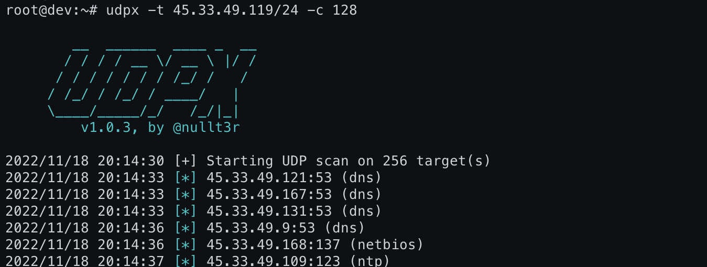

# UDPX

Fast, single-packet UDP scanner. Supports discovery of more than 45 services with the possibility to add your own. It is lightweight - grab a binary and run it anywhere you want. Linux, Mac Os and Windows are supported but can be built for more platforms.


## Options
```

        __  ______  ____ _  __
       / / / / __ \/ __ \ |/ /
      / / / / / / / /_/ /   /
     / /_/ / /_/ / ____/   |
     \____/_____/_/   /_/|_|
         v1.0.2-beta, by @nullt3r

Usage of ./udpx-linux-amd64:
  -c int
    	Maximum number of concurrent connections (default 32)
  -nr
    	Do not randomize addresses
  -o string
    	Output file to write results
  -s string
    	Scan only for a specific service, one of: ard, bacnet, bacnet_rpm, chargen, citrix, coap, db, db, digi1, digi2, digi3, dns, ipmi, ldap, mdns, memcache, mssql, nat_Port_mapping, natpmp, netbios, netis, ntp, ntp_monlist, openvpn, pca_nq, pca_st, pcanywhere, Portmap, qotd, rdp, ripv, sentinel, sip, snmp1, snmp2, snmp3, ssdp, tftp, ubiquiti, ubiquiti_discovery_v1, ubiquiti_discovery_v2, upnp, valve, wdbrpc, wsd, wsd_malformed, xdmcp, kerberos, ike
  -sp
    	Show received packets (only first 32 bytes)
  -t string
    	IP/CIDR to scan
  -tf string
    	File containing IPs/CIDRs to scan
  -w int
    	Maximum time to wait for a response (socket timeout) in ms (default 500)
```

## Building
You can grab prebuilt binaries in the release section. If you want to build UDPX from source, follow these steps:

From git:
```
git clone https://github.com/nullt3r/udpx
go build ./cmd/udpx
```
Or via go:
```
go install -v https://github.com/nullt3r/udpx@latest
```

## Supported services
The UDPX supports more then 45 services. The most interesting are:
* ipmi
* snmp
* ike
* tftp
* openvpn
* kerberos

The complete list of supported services:
* ard
* bacnet
* bacnet_rpm
* chargen
* citrix
* coap
* db
* db
* digi1
* digi2
* digi3
* dns
* ipmi
* ldap
* mdns
* memcache
* mssql
* nat_Port_mapping
* natpmp
* netbios
* netis
* ntp
* ntp_monlist
* openvpn
* pca_nq
* pca_st
* pcanywhere
* Portmap
* qotd
* rdp
* ripv
* sentinel
* sip
* snmp1
* snmp2
* snmp3
* ssdp
* tftp
* ubiquiti
* ubiquiti_discovery_v1
* ubiquiti_discovery_v2
* upnp
* valve
* wdbrpc
* wsd
* wsd_malformed
* xdmcp
* kerberos
* ike